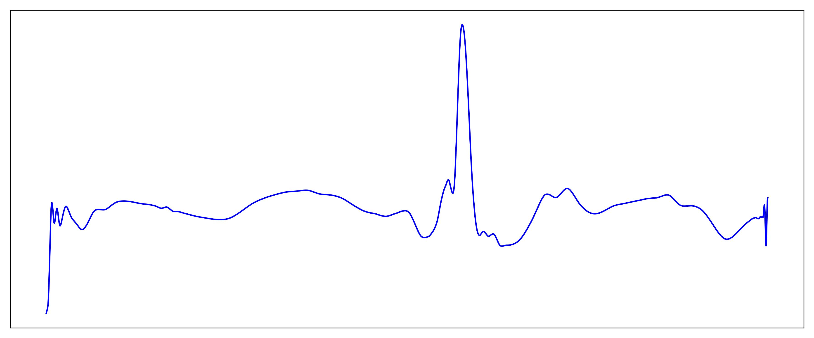
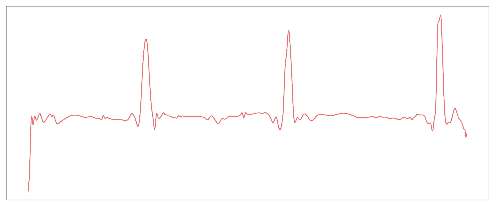

# ECG-DiReNet
a unified framework of ECG Diagnosis via Diffusion-Reinforced Network

## Why Use ECG-DiReNet for ECG Generation and Atrial Substrate Classification? 

The assessment of atrial substrate status is critical for cardiac patients, but current methods are often expensive, invasive, and complex. While personalized electrocardiographic (ECG) data offers a non-invasive alternative, the scarcity of ECG data annotated with atrial substrate status has significantly hindered the development of accurate deep learning models.

To address this challenge, our work introduces the **ECG-DiReNet** (ECG Diagnosis via Diffusion-Reinforced Network). This approach is highly effective because:

  * **Tackling Data Scarcity.** By generating a massive number of high-quality, diverse, and realistic ECG samples, the diffusion model overcomes the primary bottleneck of limited real-world data.
  * **Capturing Patient-Specific Signatures.** The generated data is not random; it is conditioned to reflect specific atrial substrate states, providing a robust dataset for training a highly accurate diagnostic model. This allows our subsequent classifier, ECG-PredNet, to learn the subtle mapping between ECG signals and the underlying atrial substrate state, achieving breakthrough diagnostic accuracy.

-----

## Overview 
[](Overview)

This study proposes ECG-DiReNet, a novel three-stage framework to enable the automated, non-invasive diagnosis of atrial substrate status using ECG data. Our paradigm is designed to simulate and enhance the clinical diagnostic workflow:

1.  **Data Generation:** We employ the **ECG LDM** to generate massive amounts of synthetic ECG training data from a small initial sample set.
2.  **Reinforcement Learning:** We introduce a "Human-in-the-loop" reinforcement learning mechanism where expert knowledge from cardiologists is used to continuously refine the generative model, ensuring the synthetic data meets high standards of medical accuracy and clinical compliance.
3.  **Model Prediction**: Finally, we train a highly accurate diagnostic model, **ECG-PredNet**, on this enhanced and expanded dataset to precisely classify atrial substrate status.

-----


## Datasets 

The dataset used in this study is a high-quality clinical ECG database collected from two major medical centers: Jiangsu Provincial People's Hospital (1,051 cases) and Sun Yat-sen Memorial Hospital of Sun Yat-sen University (171 cases), for a total of 1,222 patient samples. To fully leverage this valuable clinical data, **we segmented the original long-term ECG recordings into shorter samples, ultimately creating a training set of approximately 20,000 samples.** This dataset is clinically representative, encompassing a wide spectrum of atrial substrate states and providing a reliable foundation for model training and validation.

**Data Format:**
The shape of the generated ECG data is `[N, Len, feature]`, where:
*   `N` is the number of generated samples.
*   `Len` is the time-series length of each ECG sample.
*   `feature` is the feature dimension of the ECG signal.

**Sample:**
<p align="center">
      <strong>Normal Atrial Substrate</strong><br>

  
</p>

<p align="center">
      <strong>Abnormal Atrial Substrate</strong><br>
  
</p>


**Data Availability Statement:**
To protect patient privacy and comply with data usage agreements, the real clinical ECG data will not be made public. However, we are publicly releasing the complete synthetic dataset generated by our ECG LDM to support further research.

- **Generated ECG Dataset**: [Download Here](https://www.google.com/search?q=%23)

-----


## Package Usage 

### Requirements 

You can quickly install the corresponding dependencies.

```bash
pip install -r requirements.txt
```

### Running Experiments 

The following instructions are based on using your own custom training data. Since our clinical dataset cannot be made public due to privacy regulations, you need to prepare the dataset first and put it in the `./data` directory.
 
#### Step 1: Train the ECG LDM

```bash
# Train the diffusion model on your dataset
sh train_generator.sh
```


#### Step 2: Generate Synthetic ECG Data

```bash
sh generate_good_label.sh

sh generate_bad_label.sh
```

#### Step 3: Train the ECG-PredNet

**Option A: Train the ECG-PredNet without Pre-trained UNet**

```bash
# Train the final classifier on the combined real and synthetic dataset
sh classification.sh
```

**Option B: Train with Pre-trained UNet**


```bash
# Train the classifier using the pre-trained diffusion UNet weights
sh classification_pretrain.sh
```

