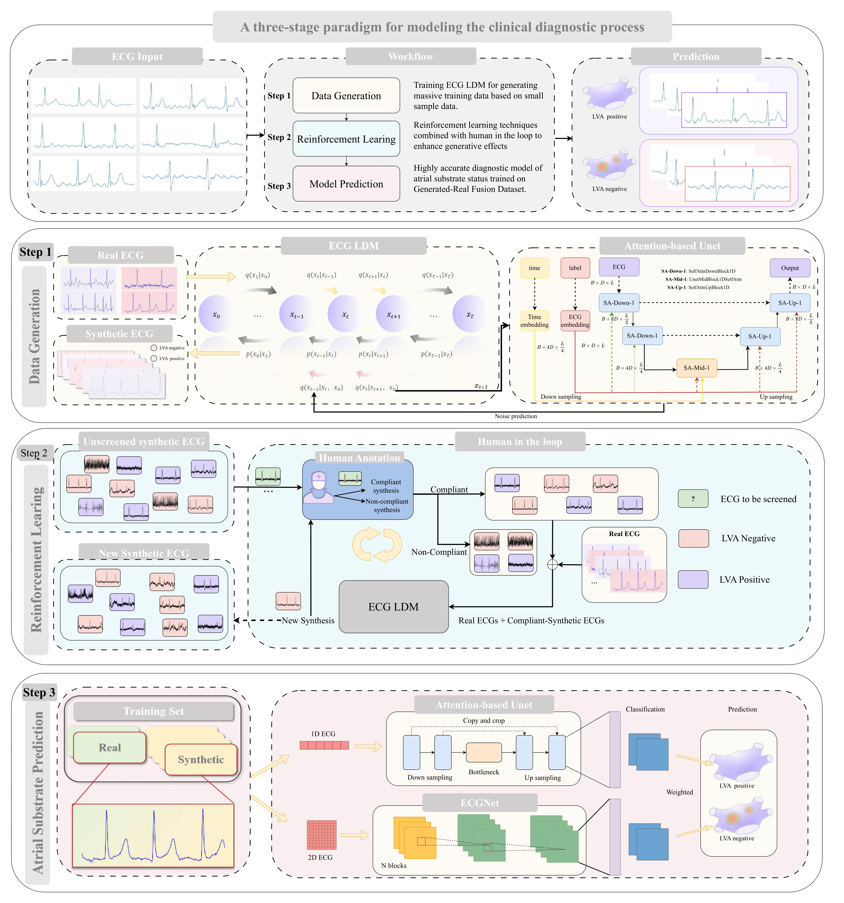

# ECG-DiReNet

## Why Use ECG-DiReNet for ECG Generation and Atrial Substrate Classification? 

The assessment of atrial substrate status is critical for cardiac patients, but current methods are often expensive, invasive, and complex. While personalized electrocardiographic (ECG) data offers a non-invasive alternative, the scarcity of ECG data annotated with atrial substrate status has significantly hindered the development of accurate deep learning models.

To address this challenge, our work introduces the **ECG-DiReNet** (ECG Diagnosis via Diffusion-Reinforced Network). This approach is highly effective because:

  * **Tackling Data Scarcity.** By generating a massive number of high-quality, diverse, and realistic ECG samples, the diffusion model overcomes the primary bottleneck of limited real-world data.
  * **Capturing Patient-Specific Signatures.** The generated data is not random; it is conditioned to reflect specific atrial substrate states, providing a robust dataset for training a highly accurate diagnostic model. This allows our subsequent classifier, ECG-PredNet, to learn the subtle mapping between ECG signals and the underlying atrial substrate state, achieving breakthrough diagnostic accuracy.

-----

## Overview 

[](Overview)

This study proposes ECG-DiReNet, a novel three-stage framework to enable the automated, non-invasive diagnosis of atrial substrate status using ECG data. Our paradigm is designed to simulate and enhance the clinical diagnostic workflow:

1.  **Data Generation:** We employ the **ECG-LDM** to generate massive amounts of synthetic ECG training data from a small initial sample set.
2.  **Reinforcement Learning:** We introduce a "Human-in-the-loop" reinforcement learning mechanism where expert knowledge from cardiologists is used to continuously refine the generative model, ensuring the synthetic data meets high standards of medical accuracy and clinical compliance.
3.  **Model Prediction**: Finally, we train a highly accurate diagnostic model, **ECG-PredNet**, on this enhanced and expanded dataset to precisely classify atrial substrate status.

-----


## Datasets 

The dataset used in this study is a high-quality clinical ECG database collected from two major medical centers: Jiangsu Provincial People's Hospital (1,051 cases) and Sun Yat-sen Memorial Hospital of Sun Yat-sen University (171 cases), totaling 1,222 patient samples. To fully leverage this valuable clinical data, we segmented the original long-term ECG recordings into shorter samples, creating a training set of approximately 20,000 real samples. This dataset is clinically representative, encompassing a wide spectrum of atrial substrate states, and provides a reliable foundation for model training and validation.


### Real Clinical Dataset 

This dataset contains valuable clinical information, covering a wide spectrum of atrial substrate states.

- **Data Status**: To protect patient privacy and comply with strict data usage agreements, the real clinical data is not publicly available. However, access can be granted for research purposes upon reasonable request. Please contact the corresponding authors for further details.


###  [Synthetic ECG Dataset](http://shuangyinli.cn/data/ecg.html) 

To overcome the limitation of not being able to share the real data and to advance research in this field, we have generated and are publicly releasing a large-scale synthetic ECG dataset using our ECG LDM model. Everyone CAN generate **MORE** samples following the ECG-LDM proposed in our work.

- **Total Samples**: 216,913
- **Labels**: Each sample is annotated with its atrial substrate status (0 for normal, 1 for abnormal).


#### Data Formats & Usage  

The synthetic dataset is provided in three formats to accommodate different research needs.


##### (1) `.npz` 

This is the raw structured format, preserving the time-series and feature dimensions, suitable for direct model training or further signal processing.  

[Download](http://www.shuangyinli.cn/data/ecg_samples_png.zip) 

- **Format Details**:  
  The `.npz` file contains two key arrays:  

  - `data`: Shape `[N, Len, feature]` where `N` (total samples), `Len` (time-series length), and `feature` (signal dimensions) are consistent with clinical ECG standards.  
  - `label`: Shape `[N]` where each element is `0` (normal atrial substrate) or `1` (abnormal atrial substrate).  

- **Python Usage Example**:  

  ```python
  import numpy as np
  
  # Load the .npz file
  with np.load("generate_data.npz") as data:
      ecg_signals = data["data"]  
      labels = data["label"]      
  # Example: Print basic info
  print(f"ecg_signals samples: {ecg_signals.shape}")
  print(f"label:  {labels.shape}")  
  ```


##### (2) `.csv` 

This format flattens the time-series and feature dimensions into a single row per sample, with labels appended as the last column, suitable for statistical analysis or tools requiring tabular input.  

[Download](http://www.shuangyinli.cn/data/ecg_samples_png.zip) 

- **Format Details**:  
  Shape `[N, Len×feature + 1]` where:  

  - The first `Len×feature` columns correspond to the flattened ECG signal.  
  - The last column is the label (`0` or `1`).  

- **Python Usage Example**:  

  ```python
  import pandas as pd
  import numpy as np
  
  # Load the .csv file
  df = pd.read_csv("generated_ecg_data.csv", header=None)  
  data_flat = df.iloc[:, :-1].values 
  labels = df.iloc[:, -1].values      
  
  Len = 2048  
  feature = 1  
  ecg_signals = data_flat.reshape(-1, Len, feature) 
  
  print(f"Reshaped signal shape: {ecg_signals.shape}")
  ```


##### (3) `.png` 

We also provide **100 PNG images** (50 for normal and 50 for abnormal) for intuitive visualization of the generated ECG waveform characteristics. The 100 png images is selected from the above generated samples. If someone needs more .png-format images, plz take the following scripts to convert.

[Download](http://www.shuangyinli.cn/data/ecg_samples_png.zip) 


- **Python Usage Example**:
  ....


[](sample)
*Example of generated ECG signals (normal vs. abnormal atrial substrate)*


**Data Availability Statement:**
To protect patient privacy and comply with data usage agreements, the real clinical ECG data will not be made public. However, the complete synthetic dataset (in `.npz`, `.csv`, and `.png` formats) generated by our ECG LDM is publicly available for research purposes.  

** ECG Dataset **

You also can visit [here](http://shuangyinli.cn/data/ecg.html) for all the datasets to download.

-----


## Package Usage 

### Requirements 

You can quickly install the corresponding dependencies.

```bash
pip install -r requirements.txt
```

### Running Experiments 

The following instructions are based on using your own custom training data. Since our clinical dataset cannot be made public due to privacy regulations, you need to prepare the dataset first and put it in the `./data` directory.

#### Step 1: Train the ECG LDM

```bash
# Train the diffusion model on your dataset
sh train_generator.sh
```


#### Step 2: Generate Synthetic ECG Data

```bash
sh generate_good_label.sh

sh generate_bad_label.sh
```

#### Step 3: Train the ECG-PredNet

**Option A: Train the ECG-PredNet without Pre-trained UNet**

```bash
# Train the final classifier on the combined real and synthetic dataset
sh classification.sh
```

**Option B: Train with Pre-trained UNet**


```bash
# Train the classifier using the pre-trained diffusion UNet weights
sh classification_pretrain.sh
```
